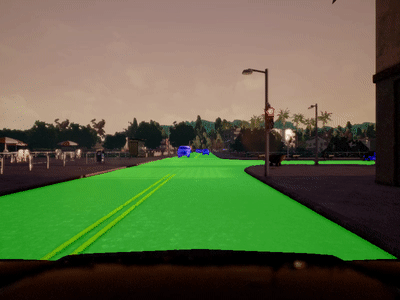

## The Lyft Perception Challenge

### Challenge Overview



Your goal in this challenge is pixel-wise identification of objects in camera images. The segmentation targets are other cars and the drivable area of the road.
Images from the [CARLA](http://carla.org/) 0.8.2 simulator are used for training and testing in the challenge.

For details see my website: __[https://NikolasEnt.github.io](https://nikolasent.github.io/proj/comp2)__.

The solution is based on a LinkNet neural network for semantic segmentation. Loss function is based on a weighted pixel-wise F-eta scores.
The approach contains some inference speed up techniques as FPS was an essential part of the competition.

### Requirements

[PyTorch 0.4](https://pytorch.org/) framework with torchvision was used for the project. Modern Nvidia GPU with CUDA 9.1 with 3 patches installed is required for correct and fast training.

Python 3.6 and several Python modules:
```
pybase64
joblib
opencv-python
numpy
matplotlib
```

### How to train

The whole training pipeline is implemented in [train.py](https://github.com/NikolasEnt/Lyft-Perception-Challenge/blob/master/train.py). Just list train and val folders in the train_dirs and val_dirs lists and run ```python train.py``` to recreate the final submission model. Several sample images are provided with the repo, see [data](https://github.com/NikolasEnt/Lyft-Perception-Challenge/tree/master/data). Each dataset folder should contain "CameraRGB" folder with images and a "CameraSeg" folder with segmentation masks from the simulator.

__Note:__ It may take about two days to train on 15601 images in the train dataset and 1500 images in the val dataset with a single Nvidia GTX 1080 Ti GPU.

For experiments and data visualization, use the [train.ipynb](https://github.com/NikolasEnt/Lyft-Perception-Challenge/blob/master/train.ipynb). It also may be useful to save the hood mask.

### How to predict

A client-server approach was used for the inferencestage, that is why one should start a server with correct [model path](https://github.com/NikolasEnt/Lyft-Perception-Challenge/blob/0c042ed05b11f31304df2e73676f2c0aaaf34382/predict-server.py#L17):
```
python predict-server.py
```

One may need to adjust batch size (`batch`) and number of threads for parallel prediction encoding (`n_jobs`) for performance maximization on a given hardware setup.

And after it is ready, the client can be used:

```
# In another terminal
python predict-client.py path/to/the/test/video
```

It will print out the prediction results as base64 masks encoded with png. To save the predictions as a json file, uncomment [lines 12-13](https://github.com/NikolasEnt/Lyft-Perception-Challenge/blob/0c042ed05b11f31304df2e73676f2c0aaaf34382/predict-client.py#L12) in the predict-client.py.
Current implementation takes 800x600 px video as an input file.
